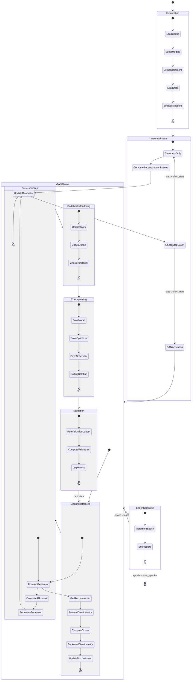
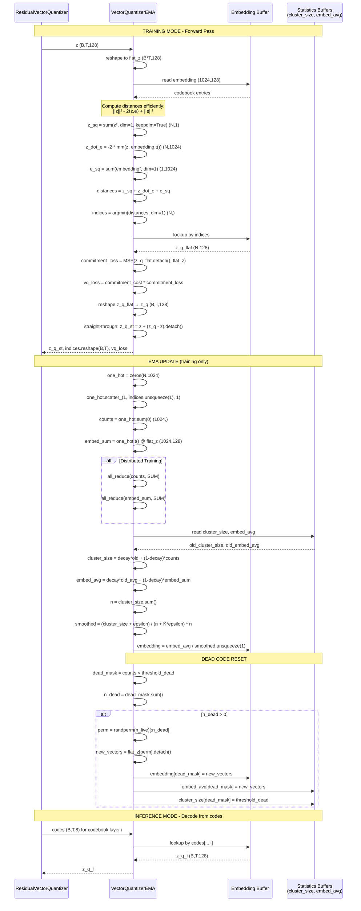

# Sirraya Lipika Tokenizer - Complete UML Diagrams

## Architecture Overview

```mermaid
graph TB
    subgraph "INPUT LAYER"
        A[Raw Audio Waveform<br/>24kHz, 16-bit] --> P[Preprocessing]
        L[Language Code<br/>ISO 639-1] --> M[Metadata Parser]
    end
    
    subgraph "PREPROCESSING"
        P --> R[Resample to 24kHz]
        R --> N[Peak Normalize [-0.98,0.98]]
        N --> C[Crop/Pad to 5s]
        C --> T[To Tensor<br/>(B,1,T)]
    end
    
    subgraph "SCRIPT ADAPTER"
        M --> S[ScriptFamily Lookup]
        S --> E[Embedding Table<br/>12×64]
        E --> Proj[Project to 512-dim]
        Proj --> Scale[Scale Head<br/>(B,512)]
        Proj --> Shift[Shift Head<br/>(B,512)]
    end
    
    subgraph "ENCODER STACK"
        T --> Stem[CausalConv1d<br/>1→512, k=7]
        Stem --> EB1[EncoderBlock 1<br/>512→1024, stride=2]
        EB1 --> EB2[EncoderBlock 2<br/>1024→2048, stride=4]
        EB2 --> EB3[EncoderBlock 3<br/>2048→4096, stride=5]
        EB3 --> EB4[EncoderBlock 4<br/>4096→8192, stride=6]
        EB4 --> BN[Bottleneck<br/>8192→512, 1×1 conv]
        BN --> LN[LayerNorm<br/>(B,100,512)]
    end
    
    subgraph "ADALN CONDITIONING"
        LN --> Mul[Element-wise Multiply]
        Scale --> Mul
        Mul --> Add[Element-wise Add]
        Shift --> Add
        Add --> Z[Latent z<br/>(B,100,512)]
    end
    
    subgraph "SEMANTIC TEACHER"
        T --> Resample[Resample to 16kHz]
        Resample --> W2V[W2V-BERT-2.0<br/>315M params, frozen]
        W2V --> Features[Layer 6 Features<br/>(B,T',1024)]
    end
    
    subgraph "RESIDUAL VECTOR QUANTIZER"
        Z --> ProjIn[Input Project<br/>512→128]
        ProjIn --> RVQ
        
        subgraph RVQ["8 Codebooks (Residual)"]
            direction TB
            CB1[Codebook 1<br/>1024×128] --> Residual1
            Residual1 --> CB2[Codebook 2<br/>1024×128]
            CB2 --> Residual2
            Residual2 --> CB3[Codebook 3<br/>1024×128]
            CB3 --> "..."
            "..." --> CB8[Codebook 8<br/>1024×128]
        end
        
        CB1 --> SemHead[Semantic Head<br/>128→256→1024]
        Features --> SemLoss[MSE Loss<br/>weight=10.0]
        SemHead --> SemLoss
        
        RVQ --> Sum[Sum Quantized]
        Sum --> ProjOut[Output Project<br/>128→512]
        ProjOut --> ZQ[Quantized z_q<br/>(B,100,512)]
        
        RVQ --> Codes[Tensor of Indices<br/>(B,100,8)]
    end
    
    subgraph "DECODER STACK"
        ZQ --> Entry[CausalConv1d<br/>512→512, k=7]
        Entry --> DB1[DecoderBlock 1<br/>512→256, stride=6]
        DB1 --> DB2[DecoderBlock 2<br/>256→128, stride=5]
        DB2 --> DB3[DecoderBlock 3<br/>128→64, stride=4]
        DB3 --> DB4[DecoderBlock 4<br/>64→32, stride=2]
        DB4 --> OutConv[CausalConv1d<br/>32→1, k=7]
        OutConv --> Tanh[Tanh<br/>[-1,1] range]
        Tanh --> Recon[Reconstructed<br/>(B,1,24000)]
    end
    
    subgraph "DISCRIMINATOR"
        T --> MSD[Multi-Scale Discriminators]
        Recon --> MSD
        
        T --> MPD[Multi-Period Discriminators]
        Recon --> MPD
        
        MSD --> DOut1[Logits + Features]
        MPD --> DOut2[Logits + Features]
    end
    
    subgraph "LOSS COMPUTATION"
        T --> L1[L1 Loss<br/>weight=0.1]
        Recon --> L1
        
        T --> Mel[MelSpectrogramLoss<br/>weight=1.0]
        Recon --> Mel
        
        T --> STFT[MultiScaleSTFTLoss<br/>weight=1.0]
        Recon --> STFT
        
        RVQ --> VQLoss[VQ Loss<br/>weight=1.0]
        
        Features --> SemLoss
        
        DOut1 --> AdvLoss[Adversarial Losses<br/>weight=3.0]
        DOut2 --> AdvLoss
        DOut1 --> FMLoss[Feature Matching<br/>weight=3.0]
        DOut2 --> FMLoss
        
        L1 --> Total[Total Loss]
        Mel --> Total
        STFT --> Total
        VQLoss --> Total
        SemLoss --> Total
        AdvLoss --> Total
        FMLoss --> Total
    end
    
    subgraph "MONITORING"
        Codes --> CBMon[CodebookMonitor]
        CBMon --> Stats[Usage %<br/>Perplexity<br/>Collapse Warning]
    end
    
    subgraph "OUTPUT"
        Codes --> TokenOut[Discrete Tokens<br/>For TTS Language Model]
        Recon --> AudioOut[Reconstructed Audio]
    end
    
    style A fill:#e1f5fe
    style L fill:#e1f5fe
    style TokenOut fill:#c8e6c9
    style AudioOut fill:#c8e6c9
    style W2V fill:#fff3e0
    style Features fill:#fff3e0
```

## Component Class Diagram

```mermaid
classDiagram
    class LipikaTokenizer {
        -audio_cfg: AudioConfig
        -rvq_cfg: RVQConfig
        -model_cfg: ModelConfig
        -encoder: AudioEncoder
        -rvq: ResidualVectorQuantizer
        -decoder: AudioDecoder
        -script_adapter: ScriptFamilyAdapter
        -semantic_teacher: Optional~SemanticTeacher~
        -mel_loss_fn: MelSpectrogramLoss
        -stft_loss_fn: MultiScaleSTFTLoss
        -cb_monitor: CodebookMonitor
        +forward(waveform, script_ids) Dict
        +encode(waveform, script_ids) Tensor
        +decode(codes) Tensor
        +frame_rate() float
        +num_parameters() int
    }
    
    class AudioConfig {
        +sample_rate: int = 24000
        +n_fft: int = 2048
        +hop_length: int = 240
        +n_mels: int = 128
        +fmin: float = 0.0
        +fmax: float = 12000.0
    }
    
    class RVQConfig {
        +n_codebooks: int = 8
        +codebook_size: int = 1024
        +codebook_dim: int = 128
        +commitment_cost: float = 0.25
        +ema_decay: float = 0.99
        +threshold_ema_dead_code: float = 2
    }
    
    class ModelConfig {
        +encoder_channels: int = 512
        +encoder_depth: int = 8
        +decoder_channels: int = 512
        +decoder_depth: int = 8
        +w2v_bert_model: str
        +w2v_bert_dim: int = 1024
        +semantic_proj_dim: int = 256
        +n_script_families: int = 12
        +script_embed_dim: int = 64
        +disc_channels: int = 64
        +disc_depth: int = 4
        +mpd_periods: List~int~
    }
    
    class TrainingConfig {
        +batch_size: int = 8
        +grad_accum_steps: int = 1
        +num_epochs: int = 200
        +learning_rate: float = 3e-4
        +disc_learning_rate: float = 3e-4
        +w_time_recon: float = 0.1
        +w_freq_recon: float = 1.0
        +w_mel: float = 1.0
        +w_vq: float = 1.0
        +w_semantic: float = 10.0
        +w_gen: float = 3.0
        +w_feat: float = 3.0
        +disc_start_step: int = 10000
    }
    
    class ScriptFamily {
        <<enumeration>>
        DEVANAGARI
        BENGALI
        GURMUKHI
        GUJARATI
        ORIYA
        TAMIL
        TELUGU
        KANNADA
        MALAYALAM
        PERSO_ARABIC
        MEITEI
        LATIN_INDIA
    }
    
    class AudioEncoder {
        -STRIDES: List~int~ = [2,4,5,6]
        -stem: CausalConv1d
        -blocks: Sequential
        -bottleneck: Sequential
        -norm: LayerNorm
        +forward(waveform, script_adapter) Tensor
        +compression_ratio() int
    }
    
    class ScriptFamilyAdapter {
        -RETROFLEX_SCRIPTS: Set
        -embed: Embedding
        -proj: Sequential
        -scale_head: Linear
        -shift_head: Linear
        +forward(script_ids) Dict~str, Tensor~
    }
    
    class ResidualVectorQuantizer {
        -input_proj: Linear
        -codebooks: ModuleList~VectorQuantizerEMA~
        -semantic_head: Sequential
        -output_proj: Linear
        -n_codebooks: int
        +forward(z, w2v_targets) Dict
        +decode_from_codes(codes) Tensor
    }
    
    class VectorQuantizerEMA {
        -codebook_size: int
        -dim: int
        -commitment_cost: float
        -decay: float
        -embedding: Buffer
        -cluster_size: Buffer
        -embed_avg: Buffer
        +forward(z) Tuple~Tensor, Tensor, Tensor~
        -_ema_update(flat_z, indices)
        -_distances(flat_z) Tensor
        -_lookup(indices) Tensor
    }
    
    class SemanticTeacher {
        -TARGET_SR: int = 16000
        -HIDDEN_LAYER: int = 6
        -feature_extractor: AutoFeatureExtractor
        -model: Wav2Vec2BertModel
        +forward(waveform_24k) Tensor
    }
    
    class AudioDecoder {
        -STRIDES: List~int~ = [6,5,4,2]
        -entry: Sequential
        -blocks: Sequential
        -out: Sequential
        +forward(z_q) Tensor
    }
    
    class MultiScaleMultiPeriodDiscriminator {
        -msds: ModuleList~ScaleDiscriminator~
        -msd_pools: ModuleList~AvgPool1d~
        -mpds: ModuleList~PeriodDiscriminator~
        +forward(x) Tuple~List~Tensor~, List~List~Tensor~~~
    }
    
    class ScaleDiscriminator {
        -layers: ModuleList
        +forward(x) Tuple~Tensor, List~Tensor~~
    }
    
    class PeriodDiscriminator {
        -period: int
        -layers: ModuleList
        +forward(x) Tuple~Tensor, List~Tensor~~
    }
    
    class MelSpectrogramLoss {
        -mel_filterbank: Buffer
        -n_fft: int
        -hop_length: int
        +forward(real, fake) Tensor
    }
    
    class MultiScaleSTFTLoss {
        -fft_sizes: List~int~
        -hop_ratios: float
        +forward(real, fake) Tensor
    }
    
    class CodebookMonitor {
        -WINDOW: int = 100
        -n_codebooks: int
        -codebook_size: int
        -_usage_buf: List~List~float~~
        -_perp_buf: List~List~float~~
        +update(codes)
        +report() Dict
        +log_to_tensorboard(writer, step)
    }
    
    class CausalConv1d {
        -causal_pad: int
        -conv: Conv1d
        +forward(x) Tensor
    }
    
    class CausalConvTranspose1d {
        -stride: int
        -conv: ConvTranspose1d
        +forward(x) Tensor
    }
    
    class ResBlock {
        -layers: Sequential
        +forward(x) Tensor
    }
    
    class EncoderBlock {
        -res: Sequential
        -down: CausalConv1d
        -stride_pool: AvgPool1d
        +forward(x) Tensor
    }
    
    class DecoderBlock {
        -up: CausalConvTranspose1d
        -res: Sequential
        +forward(x) Tensor
    }
    
    class AudioDataset {
        -AUDIO_EXTENSIONS: Set
        -data_dir: Path
        -sample_rate: int
        -max_samples: int
        -split: str
        -files: List~Path~
        +__len__() int
        +__getitem__(idx) Dict
    }
    
    class CheckpointManager {
        -ckpt_dir: Path
        -keep: int
        -rank: int
        +save(step, model, disc, opts, scheds, metrics, configs)
        +load(path, model, disc, opts, scheds) int
        +latest() Optional~Path~
    }
    
    LipikaTokenizer *-- AudioEncoder
    LipikaTokenizer *-- ResidualVectorQuantizer
    LipikaTokenizer *-- AudioDecoder
    LipikaTokenizer *-- ScriptFamilyAdapter
    LipikaTokenizer o-- SemanticTeacher
    LipikaTokenizer *-- MelSpectrogramLoss
    LipikaTokenizer *-- MultiScaleSTFTLoss
    LipikaTokenizer *-- CodebookMonitor
    
    ResidualVectorQuantizer *-- VectorQuantizerEMA : 8 codebooks
    ResidualVectorQuantizer --> SemanticTeacher : uses for distillation
    
    AudioEncoder *-- CausalConv1d
    AudioEncoder *-- EncoderBlock
    EncoderBlock *-- ResBlock
    EncoderBlock *-- CausalConv1d
    
    AudioDecoder *-- CausalConvTranspose1d
    AudioDecoder *-- DecoderBlock
    DecoderBlock *-- ResBlock
    
    MultiScaleMultiPeriodDiscriminator *-- ScaleDiscriminator : 3 scales
    MultiScaleMultiPeriodDiscriminator *-- PeriodDiscriminator : 5 periods
```



## Data Flow Sequence Diagram

```mermaid
sequenceDiagram
    participant User
    participant Dataset as AudioDataset
    participant Preproc as Preprocessor
    participant Adapter as ScriptFamilyAdapter
    participant Encoder as AudioEncoder
    participant Teacher as SemanticTeacher
    participant RVQ as ResidualVectorQuantizer
    participant VQ as VectorQuantizerEMA
    participant Decoder as AudioDecoder
    participant Disc as MultiScaleMultiPeriodDiscriminator
    participant Loss as Loss Functions
    participant Monitor as CodebookMonitor
    participant Optim as Optimizer
    
    Note over User,Optim: TRAINING PHASE
    
    User->>Dataset: Provide audio files + language metadata
    Dataset->>Preproc: Raw audio (variable SR)
    
    Preproc->>Preproc: Resample to 24kHz
    Preproc->>Preproc: Convert to mono
    Preproc->>Preproc: Random crop (max 5s)
    Preproc->>Preproc: Peak normalize to [-0.98,0.98]
    Preproc-->>Encoder: waveform (B,1,24000)
    Preproc-->>Adapter: script_ids (B,)
    
    Adapter->>Adapter: Lookup script embeddings
    Adapter->>Adapter: Project to 512-dim
    Adapter->>Adapter: Generate scale & shift
    Adapter-->>Encoder: scale, shift (B,512)
    
    Note over Encoder: Encode waveform to latent
    
    Encoder->>Encoder: Stem conv (1→512)
    Encoder->>Encoder: EncoderBlock 1 (stride=2)
    Encoder->>Encoder: EncoderBlock 2 (stride=4)
    Encoder->>Encoder: EncoderBlock 3 (stride=5)
    Encoder->>Encoder: EncoderBlock 4 (stride=6)
    Encoder->>Encoder: Bottleneck (8192→512)
    Encoder->>Encoder: LayerNorm
    Encoder->>Encoder: Apply AdaLN (scale×shift)
    Encoder-->>RVQ: latent z (B,100,512)
    
    par Semantic Distillation Path
        Teacher->>Teacher: Resample to 16kHz
        Teacher->>Teacher: W2V-BERT forward pass
        Teacher-->>RVQ: linguistic features (B,T',1024)
    end
    
    Note over RVQ,VQ: Residual Vector Quantization
    
    RVQ->>RVQ: Input projection (512→128)
    RVQ->>VQ: residual = z_proj
    
    loop 8 codebooks
        VQ->>VQ: Compute distances to all 1024 entries
        VQ->>VQ: Find argmin indices
        VQ->>VQ: Lookup quantized vectors
        VQ->>VQ: Compute commitment loss
        VQ-->>RVQ: z_q_i, indices_i, loss_i
        
        RVQ->>RVQ: z_q_total += z_q_i
        RVQ->>RVQ: residual = residual - z_q_i.detach()
        RVQ->>RVQ: Store indices_i
        RVQ->>RVQ: Accumulate VQ loss
    end
    
    alt First codebook and teacher available
        RVQ->>RVQ: Semantic head on z_q_1
        RVQ->>RVQ: MSE loss with teacher features
    end
    
    RVQ->>RVQ: Stack indices → (B,100,8)
    RVQ->>RVQ: Output projection (128→512)
    RVQ-->>Decoder: quantized z_q (B,100,512)
    RVQ-->>Monitor: codes (B,100,8)
    
    Note over Decoder: Decode to waveform
    
    Decoder->>Decoder: Entry conv
    Decoder->>Decoder: DecoderBlock 1 (stride=6)
    Decoder->>Decoder: DecoderBlock 2 (stride=5)
    Decoder->>Decoder: DecoderBlock 3 (stride=4)
    Decoder->>Decoder: DecoderBlock 4 (stride=2)
    Decoder->>Decoder: Output conv + Tanh
    Decoder-->>Loss: reconstructed (B,1,24000)
    Decoder-->>Disc: reconstructed (for adversarial)
    
    Note over Disc: Discriminator evaluation
    
    Disc->>Disc: Multi-scale discriminators (3 scales)
    Disc->>Disc: Multi-period discriminators (5 periods)
    Disc-->>Loss: real_logits, fake_logits
    Disc-->>Loss: real_features, fake_features
    
    Note over Loss: Compute all loss components
    
    Loss->>Loss: L1 loss (waveform)
    Loss->>Loss: Mel spectrogram loss
    Loss->>Loss: Multi-scale STFT loss
    Loss->>Loss: VQ loss (commitment)
    Loss->>Loss: Semantic loss (if teacher)
    Loss->>Loss: Adversarial loss (hinge)
    Loss->>Loss: Feature matching loss
    
    Loss->>Loss: Weighted sum → total_loss
    
    Note over Optim: Backpropagation
    
    alt GAN active (step ≥ disc_start)
        Optim->>Disc: Update discriminator
        Optim->>Disc: Zero grad
        Optim->>Disc: Backward d_loss
        Optim->>Disc: Clip gradients
        Optim->>Disc: Optimizer step
    end
    
    Optim->>Encoder: Update generator
    Optim->>RVQ: Update generator (via straight-through)
    Optim->>Decoder: Update generator
    Optim->>Optim: Zero grad
    Optim->>Optim: Backward total_loss
    Optim->>Optim: Clip gradients
    Optim->>Optim: Optimizer step
    
    Note over Monitor: Codebook health check
    
    Monitor->>Monitor: Update usage statistics
    Monitor->>Monitor: Calculate usage % per codebook
    Monitor->>Monitor: Calculate perplexity
    Monitor->>Monitor: Check for dead codes (<2 uses)
    
    alt Dead codes detected
        Monitor->>RVQ: Reset dead codebook entries
        RVQ->>RVQ: Replace with random batch vectors
    end
    
    alt Usage < 20% for any codebook
        Monitor-->>User: Collapse warning!
    end
    
    Note over User,Optim: INFERENCE PHASE (Encoding)
    
    User->>Encoder: waveform + script_id
    Encoder-->>RVQ: latent z
    RVQ-->>User: codes (B,100,8)
    
    Note over User,Optim: INFERENCE PHASE (Decoding)
    
    User->>RVQ: codes (B,100,8)
    RVQ->>RVQ: Lookup each codebook
    RVQ->>RVQ: Sum quantized vectors
    RVQ-->>Decoder: z_q
    Decoder-->>User: reconstructed waveform
```



## Training State Diagram



## Package Component Diagram

```mermaid
graph TB
    subgraph "LIPIKA TOKENIZER SYSTEM"
        
        subgraph "CONFIGURATION"
            AC[AudioConfig]
            RC[RVQConfig]
            MC[ModelConfig]
            TC[TrainingConfig]
        end
        
        subgraph "CORE MODELS"
            LT[LipikaTokenizer]
            ENC[AudioEncoder]
            RVQ[ResidualVectorQuantizer]
            DEC[AudioDecoder]
            SFA[ScriptFamilyAdapter]
        end
        
        subgraph "QUANTIZATION"
            VQ[VectorQuantizerEMA]
            CBM[CodebookMonitor]
        end
        
        subgraph "SEMANTIC"
            ST[SemanticTeacher]
            SH[SemanticHead]
        end
        
        subgraph "DISCRIMINATOR"
            MSD[MultiScaleMultiPeriodDiscriminator]
            SC[ScaleDiscriminator]
            PD[PeriodDiscriminator]
        end
        
        subgraph "LOSSES"
            MEL[MelSpectrogramLoss]
            STFT[MultiScaleSTFTLoss]
            HL[HingeLoss]
            FM[FeatureMatching]
        end
        
        subgraph "DATA"
            DS[AudioDataset]
            COLL[CollateFn]
        end
        
        subgraph "TRAINING"
            CKPT[CheckpointManager]
            SCHED[CosineScheduler]
            DIST[DistributedSetup]
        end
        
        subgraph "INFERENCE"
            ENCODE[encode_audio_file]
            DECODE[decode_codes_to_file]
            EXPORT[export_torchscript]
        end
        
        subgraph "BUILDING_BLOCKS"
            CC1[CausalConv1d]
            CCT[CausalConvTranspose1d]
            RB[ResBlock]
            EB[EncoderBlock]
            DB[DecoderBlock]
        end
        
    end
    
    subgraph "EXTERNAL_DEPENDENCIES"
        PT[PyTorch]
        HF[HuggingFace Transformers]
        LB[Librosa]
        SF[SoundFile]
        TB[TensorBoard]
    end
    
    LT --> ENC
    LT --> RVQ
    LT --> DEC
    LT --> SFA
    LT o-- ST
    LT --> MEL
    LT --> STFT
    LT --> CBM
    
    RVQ --> VQ
    RVQ --> SH
    SH --> ST
    
    MSD --> SC
    MSD --> PD
    
    ENC --> CC1
    ENC --> EB
    EB --> RB
    EB --> CC1
    
    DEC --> CCT
    DEC --> DB
    DB --> RB
    DB --> CCT
    
    DS --> COLL
    
    CKPT --> LT
    SCHED --> TC
    DIST --> TC
    
    ENCODE --> LT
    DECODE --> LT
    EXPORT --> LT
    
    LT --> PT
    ST --> HF
    DS --> LB
    DS --> SF
    CBM --> TB
```

## Deployment Architecture Diagram

```mermaid
graph TB
    subgraph "DEVELOPMENT ENVIRONMENT"
        DEV[Developer Workstation]
        CODE[Source Code Repository<br/>GitHub]
        DOCS[Documentation<br/>Sphinx/ReadTheDocs]
    end
    
    subgraph "TRAINING INFRASTRUCTURE"
        subgraph "GPU Cluster"
            direction TB
            
            subgraph "Node 1 - GPU 0 (Rank 0)"
                M0[Model Replica]
                O0[Optimizer State]
                G0[Gradient Accumulation]
                CB0[Codebook Monitor]
            end
            
            subgraph "Node 1 - GPU 1 (Rank 1)"
                M1[Model Replica]
                O1[Optimizer State]
                G1[Gradient Accumulation]
            end
            
            subgraph "Node 2 - GPU 2 (Rank 2)"
                M2[Model Replica]
                O2[Optimizer State]
                G2[Gradient Accumulation]
            end
            
            subgraph "Node 2 - GPU 3 (Rank 3)"
                M3[Model Replica]
                O3[Optimizer State]
                G3[Gradient Accumulation]
            end
            
            DDP[DDP Communication<br/>NCCL Backend]
            
            M0 <--> DDP
            M1 <--> DDP
            M2 <--> DDP
            M3 <--> DDP
        end
        
        subgraph "STORAGE"
            DATA[(Training Data<br/>NFS/Shared Storage)]
            CKPT[(Checkpoints<br/>Rolling 5 latest)]
            LOGS[(Training Logs<br/>TensorBoard Events)]
            EXPORT[(Exported Models<br/>TorchScript/ONNX)]
        end
        
        subgraph "MONITORING"
            TBV[TensorBoard<br/>Visualization]
            PROM[Prometheus<br/>Metrics]
            GRAF[Grafana<br/>Dashboards]
        end
        
        GPU Cluster --> DATA
        GPU Cluster --> CKPT
        GPU Cluster --> LOGS
        LOGS --> TBV
        LOGS --> PROM
        PROM --> GRAF
    end
    
    subgraph "INFERENCE SERVING"
        subgraph "API Servers"
            REST[REST API<br/>FastAPI]
            GRPC[gRPC Service]
            WS[WebSocket<br/>Streaming]
        end
        
        subgraph "Model Instances"
            M_INF1[Model Instance 1<br/>CPU/GPU]
            M_INF2[Model Instance 2<br/>CPU/GPU]
            M_INF3[Model Instance 3<br/>CPU/GPU]
            LB[Load Balancer]
        end
        
        subgraph "Client Applications"
            TTS[TTS Application]
            MOBILE[Mobile App]
            WEB[Web App]
            RESEARCH[Research Pipeline]
        end
        
        CKPT --> M_INF1
        CKPT --> M_INF2
        CKPT --> M_INF3
        
        REST --> LB
        GRPC --> LB
        WS --> LB
        LB --> M_INF1
        LB --> M_INF2
        LB --> M_INF3
        
        TTS --> REST
        MOBILE --> GRPC
        WEB --> WS
        RESEARCH --> REST
    end
    
    subgraph "CI/CD PIPELINE"
        GHA[GitHub Actions]
        TEST[Test Suite<br/>Unit + Integration]
        BUILD[Build Artifacts]
        DEPLOY[Deploy to Staging]
        PROMOTE[Promote to Production]
        
        CODE --> GHA
        GHA --> TEST
        TEST --> BUILD
        BUILD --> DEPLOY
        DEPLOY --> PROMOTE
        PROMOTE --> CKPT
    end
    
    DEV --> CODE
    DEV --> DOCS
    CODE --> GHA
```

## End-to-End Data Flow Diagram

```mermaid
flowchart TD
    subgraph "INPUT"
        A[Audio File<br/>.wav/.flac/.mp3]
        L[Language Code<br/>e.g., 'hi', 'ta', 'bn']
    end
    
    subgraph "PREPROCESSING"
        A --> LOAD[soundfile.read]
        LOAD --> MONO[Convert to Mono]
        MONO --> RESAMPLE[Resample to 24kHz<br/>librosa.resample]
        RESAMPLE --> NORMALIZE[Peak Normalize to [-0.98,0.98]]
        NORMALIZE --> CROP[Random Crop to 5s<br/>or Pad if Shorter]
        CROP --> TENSOR[Convert to Torch Tensor<br/>(1, T)]
        
        L --> LOOKUP[LANG_TO_SCRIPT Mapping]
        LOOKUP --> SCRIPT[Script ID<br/>0-11]
    end
    
    subgraph "ENCODING"
        TENSOR --> BATCH[Add Batch Dimension<br/>(B,1,T)]
        BATCH --> ENCODER
        
        SCRIPT --> ADAPTER[ScriptFamilyAdapter]
        ADAPTER --> SCALE[Generate Scale (B,512)]
        ADAPTER --> SHIFT[Generate Shift (B,512)]
        
        ENCODER[AudioEncoder] --> LATENT[Latent z<br/>(B,100,512)]
        SCALE --> ADALN[Apply AdaLN<br/>x = x*scale + shift]
        SHIFT --> ADALN
        LATENT --> ADALN
        ADALN --> Z_COND[Conditioned Latent<br/>(B,100,512)]
    end
    
    subgraph "QUANTIZATION"
        Z_COND --> PROJ_IN[Input Projection<br/>512→128]
        PROJ_IN --> Z_PROJ[(B,100,128)]
        
        Z_PROJ --> CB1[Codebook 1<br/>1024×128]
        
        CB1 --> Q1[Quantized 1]
        CB1 --> IDX1[Index 1]
        CB1 --> LOSS1[Loss 1]
        
        Q1 --> SUM[Sum Quantized]
        Q1 --> RESID1[Residual = Original - Q1]
        
        RESID1 --> CB2[Codebook 2<br/>1024×128]
        CB2 --> Q2[Quantized 2]
        CB2 --> IDX2[Index 2]
        CB2 --> LOSS2[Loss 2]
        
        Q2 --> SUM
        Q2 --> RESID2[Residual = Residual - Q2]
        
        RESID2 --> CB3[Codebook 3<br/>1024×128]
        CB3 --> Q3[Quantized 3]
        CB3 --> IDX3[Index 3]
        CB3 --> LOSS3[Loss 3]
        
        Q3 --> SUM
        
        RESID2 --> "..."
        "..." --> CB8[Codebook 8<br/>1024×128]
        CB8 --> Q8[Quantized 8]
        CB8 --> IDX8[Index 8]
        CB8 --> LOSS8[Loss 8]
        
        Q8 --> SUM
        
        SUM --> Z_Q_SUM[(B,100,128)]
        Z_Q_SUM --> PROJ_OUT[Output Projection<br/>128→512]
        PROJ_OUT --> Z_Q[(B,100,512)]
        
        IDX1 --> STACK[Stack Indices]
        IDX2 --> STACK
        IDX3 --> STACK
        IDX8 --> STACK
        STACK --> CODES[Tensor of Codes<br/>(B,100,8)]
        
        LOSS1 --> VQ_LOSS_SUM[Sum VQ Losses]
        LOSS2 --> VQ_LOSS_SUM
        LOSS3 --> VQ_LOSS_SUM
        LOSS8 --> VQ_LOSS_SUM
        VQ_LOSS_SUM --> VQ_LOSS[Total VQ Loss<br/>weight=1.0]
    end
    
    subgraph "SEMANTIC DISTILLATION"
        TENSOR --> RESAMPLE_16k[Resample to 16kHz]
        RESAMPLE_16k --> W2V[W2V-BERT-2.0<br/>Frozen, 315M params]
        W2V --> FEATURES[Layer 6 Features<br/>(B,T',1024)]
        
        Q1 --> SEM_HEAD[Semantic Head<br/>128→256→1024 MLP]
        SEM_HEAD --> PRED[Predicted Features<br/>(B,100,1024)]
        
        PRED --> SEM_LOSS_COMP[MSE Loss]
        FEATURES --> SEM_LOSS_COMP
        SEM_LOSS_COMP --> SEM_LOSS[Semantic Loss<br/>weight=10.0]
    end
    
    subgraph "DECODING"
        Z_Q --> DECODER[AudioDecoder]
        
        DECODER --> UPSAMPLE1[DecoderBlock 1<br/>stride=6: 100→600]
        UPSAMPLE1 --> UPSAMPLE2[DecoderBlock 2<br/>stride=5: 600→3000]
        UPSAMPLE2 --> UPSAMPLE3[DecoderBlock 3<br/>stride=4: 3000→12000]
        UPSAMPLE3 --> UPSAMPLE4[DecoderBlock 4<br/>stride=2: 12000→24000]
        UPSAMPLE4 --> OUTPUT_CONV[Output Conv + Tanh]
        OUTPUT_CONV --> RECON[Reconstructed Waveform<br/>(B,1,24000)]
    end
    
    subgraph "LOSS COMPUTATION"
        TENSOR --> L1_COMP[L1 Loss]
        RECON --> L1_COMP
        L1_COMP --> L1[weight=0.1]
        
        TENSOR --> MEL_COMP[MelSpectrogramLoss<br/>128 bands]
        RECON --> MEL_COMP
        MEL_COMP --> MEL[weight=1.0]
        
        TENSOR --> STFT_COMP[MultiScaleSTFTLoss<br/>256,512,1024,2048]
        RECON --> STFT_COMP
        STFT_COMP --> STFT[weight=1.0]
        
        L1 --> TOTAL_LOSS[Total Loss]
        MEL --> TOTAL_LOSS
        STFT --> TOTAL_LOSS
        VQ_LOSS --> TOTAL_LOSS
        SEM_LOSS --> TOTAL_LOSS
        
        TENSOR --> DISC_REAL[Discriminator - Real]
        RECON --> DISC_FAKE[Discriminator - Fake]
        
        DISC_REAL --> ADV_COMP[Hinge Adversarial Loss]
        DISC_FAKE --> ADV_COMP
        ADV_COMP --> ADV[weight=3.0]
        
        DISC_REAL --> FM_COMP[Feature Matching Loss]
        DISC_FAKE --> FM_COMP
        FM_COMP --> FM[weight=3.0]
        
        ADV --> TOTAL_LOSS
        FM --> TOTAL_LOSS
    end
    
    subgraph "MONITORING"
        CODES --> MONITOR[CodebookMonitor]
        MONITOR --> USAGE[Usage % per Codebook]
        MONITOR --> PERP[Perplexity per Codebook]
        MONITOR --> DEAD[Dead Code Detection]
        
        USAGE --> WARNING{Collapse?}
        WARNING -->|Usage < 20%| ALERT[⚠️ Collapse Warning]
        WARNING -->|Usage ≥ 20%| OK[✅ Healthy]
        
        DEAD --> RESET{Dead Codes?}
        RESET -->|count < 2| REINIT[Reset with Batch Vectors]
        REINIT --> MONITOR
    end
    
    subgraph "OUTPUT"
        CODES --> SAVE_CODES[Save to .pt file<br/>for TTS LM]
        RECON --> SAVE_AUDIO[Save to .wav file<br/>sf.write]
        
        SAVE_CODES --> TOKEN_VIS[Visualization:<br/>[42,137,89,256,...]]
        SAVE_AUDIO --> AUDIO_VIS[Playback/Evaluation]
    end
    
    TOTAL_LOSS --> BACKPROP[Backpropagation<br/>Update Parameters]
    
    style A fill:#e1f5fe
    style L fill:#e1f5fe
    style SAVE_CODES fill:#c8e6c9
    style SAVE_AUDIO fill:#c8e6c9
    style W2V fill:#fff3e0
    style FEATURES fill:#fff3e0
    style ALERT fill:#ffcdd2
```

## Training Loop Activity Diagram

```mermaid
flowchart TD
    Start([Start Training]) --> Init[Initialize:<br/>- Model<br/>- Discriminator<br/>- Optimizers<br/>- Schedulers<br/>- DataLoaders]
    
    Init --> LoadCheckpoint{Resume from<br/>checkpoint?}
    LoadCheckpoint -->|Yes| Restore[Load model state<br/>Load optimizer state<br/>Load scheduler state<br/>Restore step counter]
    LoadCheckpoint -->|No| Fresh[Start fresh<br/>step=0]
    
    Restore --> EpochLoop
    Fresh --> EpochLoop
    
    subgraph EpochLoop [For each epoch]
        direction TB
        
        SetEpoch[Set epoch for sampler] --> BatchLoop
        
        subgraph BatchLoop [For each batch]
            direction TB
            
            LoadBatch[Load batch:<br/>waveform, script_ids] --> MoveToGPU[Move to device]
            MoveToGPU --> ZeroGrad[Zero gradients]
            
            ZeroGrad --> GANCheck{GAN active?<br/>step ≥ disc_start}
            
            GANCheck -->|Yes| DiscUpdate[Discriminator Update]
            GANCheck -->|No| GenOnly[Generator Only]
            
            subgraph DiscUpdate [Discriminator Update]
                direction TB
                
                WithNoGrad[with torch.no_grad] --> FwdModel[Model forward pass]
                FwdModel --> DetachFake[Get reconstructed.detach]
                DetachFake --> DiscFwdFake[Discriminator forward on fake]
                DiscFwdFake --> DiscFwdReal[Discriminator forward on real]
                DiscFwdReal --> ComputeDLoss[Compute d_loss = hinge_loss]
                ComputeDLoss --> ScaleDLoss[scaler_disc.scale(d_loss)]
                ScaleDLoss --> BackwardDisc[Backward pass]
                BackwardDisc --> UnscaleDisc[scaler_disc.unscale_]
                UnscaleDisc --> ClipDisc[clip_grad_norm_]
                ClipDisc --> StepDisc[scaler_disc.step]
                StepDisc --> UpdateDisc[scaler_disc.update]
                UpdateDisc --> StepDiscSched[disc_scheduler.step]
            end
            
            subgraph GenUpdate [Generator Update]
                direction TB
                
                FwdModelGen[Model forward pass] --> ComputeLosses[Compute all losses]
                ComputeLosses --> GANCheck2{GAN active?}
                
                GANCheck2 -->|Yes| AddGANLosses[Add adv_loss + feat_loss]
                GANCheck2 -->|No| SkipGAN[Skip GAN losses]
                
                AddGANLosses --> CombineLoss[Combine weighted losses]
                SkipGAN --> CombineLoss
                
                CombineLoss --> ScaleLoss[scaler_gen.scale(loss/grad_accum)]
                ScaleLoss --> BackwardGen[Backward pass]
                BackwardGen --> AccumStep{step % grad_accum == 0?}
                
                AccumStep -->|Yes| UnscaleGen[scaler_gen.unscale_]
                UnscaleGen --> ClipGen[clip_grad_norm_]
                ClipGen --> StepGen[scaler_gen.step]
                StepGen --> UpdateGen[scaler_gen.update]
                UpdateGen --> ZeroGradAfter[Zero gradients]
                ZeroGradAfter --> StepGenSched[gen_scheduler.step]
                
                AccumStep -->|No| Continue[Continue accumulation]
            end
            
            DiscUpdate --> GenUpdate
            GenOnly --> GenUpdate
            
            GenUpdate --> UpdateMonitor[Update codebook monitor]
            UpdateMonitor --> CheckCollapse{Collapse?}
            CheckCollapse -->|Yes| LogWarning[Log warning]
            CheckCollapse -->|No| ContinueLoop
            
            LogWarning --> ContinueLoop
            ContinueLoop --> IncrementStep[global_step++]
            
            IncrementStep --> LogStep{step % 50 == 0?}
            LogStep -->|Yes| LogMetrics[Log to TensorBoard]
            LogStep -->|No| CheckSave
            
            LogMetrics --> CheckSave{step % save_every == 0?}
            CheckSave -->|Yes| SaveCheckpoint[Save checkpoint]
            CheckSave -->|No| CheckVal{step % eval_every == 0?}
            
            SaveCheckpoint --> CheckVal
            
            CheckVal -->|Yes| RunValidation[Run validation loop]
            CheckVal -->|No| NextBatch[Next batch]
            
            RunValidation --> NextBatch
        end
        
        BatchLoop --> EpochEnd[End of epoch]
        EpochEnd --> LogEpoch[Log epoch metrics]
    end
    
    EpochLoop --> TrainingComplete[Training complete]
    TrainingComplete --> CloseWriter[Close TensorBoard writer]
    CloseWriter --> Cleanup[Cleanup distributed]
    Cleanup --> End([End])
```

## Codebook Operation Sequence



